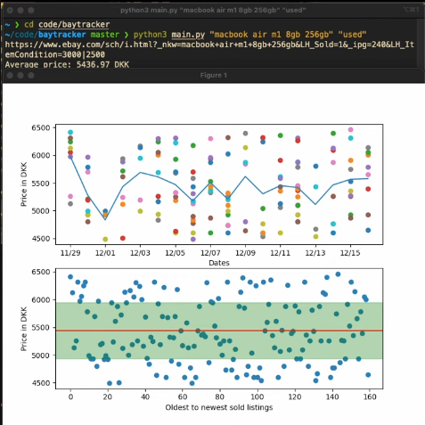

**Descrition:** 
This program shows price history of sold listings on eBay for a given item

**Demo Image**

The term "macboor air m1 8gb 256gb" is searched for, and recent 'sold prices' from ebay listings are shown.



**Prerequisites:**
```
pip install numpy
pip install selenium
pip install beautifulsoup4
pip install matplotlib
```
Aswell as ChromeWebdriver

**Usage:** ```python3 main.py ITEM CONDTION``` \
Valid conditions are: 'working', 'new', 'used' 'defect'. \
Where 'working' is 'new' + 'used'

**Example:** ```python3 main.py "ThinkPad x220" "working"```
